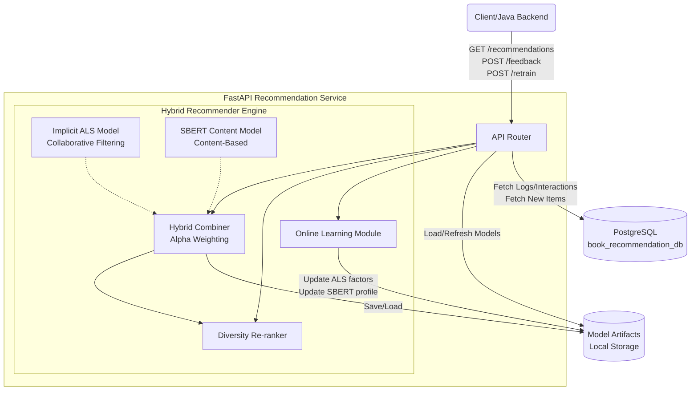

# Book Recommendation System Documentation

## 1. Sơ đồ Kiến trúc Hệ thống (Architecture Diagram)



## 2. Các API Endpoint Chính

Base URL: `http://<host>:8003/api/v1`

### 2.1. `GET /recommendations`
Lấy danh sách sách gợi ý cho một user. Hệ thống sẽ kết hợp Collaborative Filtering (ALS) và Content-based (SBERT).

**Query Parameters:**
- `user_id` (int, required): ID của người dùng.
- `limit` (int, optional): Số lượng sách gợi ý trả về (mặc định: 10).

**Response (200 OK):**
```json
{
  "user_id": 1,
  "results": [
    {
      "book_id": 101,
      "score": 0.85,
      "source": "hybrid",
      "hybrid_score": 0.85,
      "cf_score": 0.9,
      "cb_score": 0.8
    }
  ],
  "model_used": "Implicit ALS + SBERT",
  "processing_time_ms": 45
}
```

### 2.2. `GET /similar`
Lấy danh sách các sách tương tự với cuốn sách cụ thể dựa trên Item-Item Collaborative Filtering và Semantic Similarity (SBERT).

**Query Parameters:**
- `book_id` (int, required): ID của sách gốc.
- `limit` (int, optional): Số lượng sách trả về (mặc định: 10).

**Response (200 OK):**
```json
{
  "target_book_id": 101,
  "results": [
    {
      "book_id": 105,
      "score": 0.92,
      "source": "hybrid"
    }
  ]
}
```

### 2.3. `GET /diversity`
Lấy danh sách sách gợi ý nhưng có áp dụng thuật toán tối ưu hóa độ đa dạng (MMR/Diversity reranking) để tránh gợi ý các sách quá giống nhau.

**Query Parameters:**
- `user_id` (int, required): ID người dùng.
- `limit` (int, optional): Số lượng (mặc định: 10).
- `diversity_weight` (float, optional): Trọng số đa dạng (mặc định: 0.3).

**Response (200 OK):** Tương tự `/recommendations` nhưng danh sách được sắp xếp cho đa dạng hơn.

### 2.4. `POST /feedback`
Nhận feedback/interaction từ người dùng (click, view, read, rating) để online learning hoặc log lại.

**Request Body:**
```json
{
  "user_id": 1,
  "book_id": 101,
  "interaction_type": "read",
  "rating": 5,
  "timestamp": "2026-05-06T10:00:00Z"
}
```

### 2.5. `POST /retrain`
Yêu cầu hệ thống train lại mô hình (chạy ngầm).

**Response (202 Accepted):**
```json
{
  "message": "Retraining started in background",
  "status": "processing"
}
```

### 2.6. `POST /online-learning/update`
Cho phép hệ thống cập nhật online learning vector (ngay lập tức) thay vì đợi retrain batch. 

**Request Body:**
```json
{
  "user_id": 1,
  "book_id": 101,
  "interaction_value": 1.0
}
```

### 2.7. `/health` & `/model/info`
- `GET /health`: Kiểm tra trạng thái service và model (đã loaded chưa).
- `GET /model/info`: Lấy thông số model hiện tại (số lượng user vector, item vector, version,...).

## 3. Hướng dẫn Tích hợp (Phía Backend System - Java/Nodejs...)

1. **Khởi tạo System:**
   Chạy service Suggestion (FastAPI) qua Docker Compose hoặc trực tiếp bằng `python server.py`. Model sẽ tự load hoặc train nếu chưa có artifact.

2. **Cách luồng hoạt động tích hợp:**
   - **Khi User vào trang chủ:** Backend chính gọi `GET /api/v1/recommendations?user_id=...` -> Dùng danh sách `book_id` trả về để query DB chính, lấy thông tin sách (title, image) và show ra UI.
   - **Khi User xem trang chi tiết Sách:** Backend chính gọi `GET /api/v1/similar?book_id=...` -> Query DB để lấy thông tin UI cho phần "Sách tương tự".
   - **Khi User tương tác (đọc sách, đánh giá, click...):** Backend chính gửi Async / Queue request hoặc đẩy trực tiếp Data vào Data Warehouse/DB, đồng thời có thể gọi webhook `POST /api/v1/feedback` hoặc `POST /api/v1/online-learning/update` để model Recommendation cập nhật profile user tức thì.
   - **Schedule Retrain:** Backend có thể hẹn giờ (ví dụ 12h đêm) gọi `POST /api/v1/retrain` để hệ thống update model tổng thể cho data mới trong ngày.

3. **Deploy qua Docker:**
   ```bash
   docker-compose up -d recommender-implicit
   ```