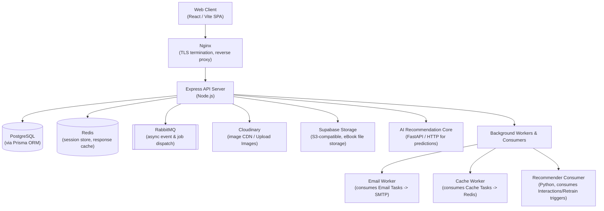
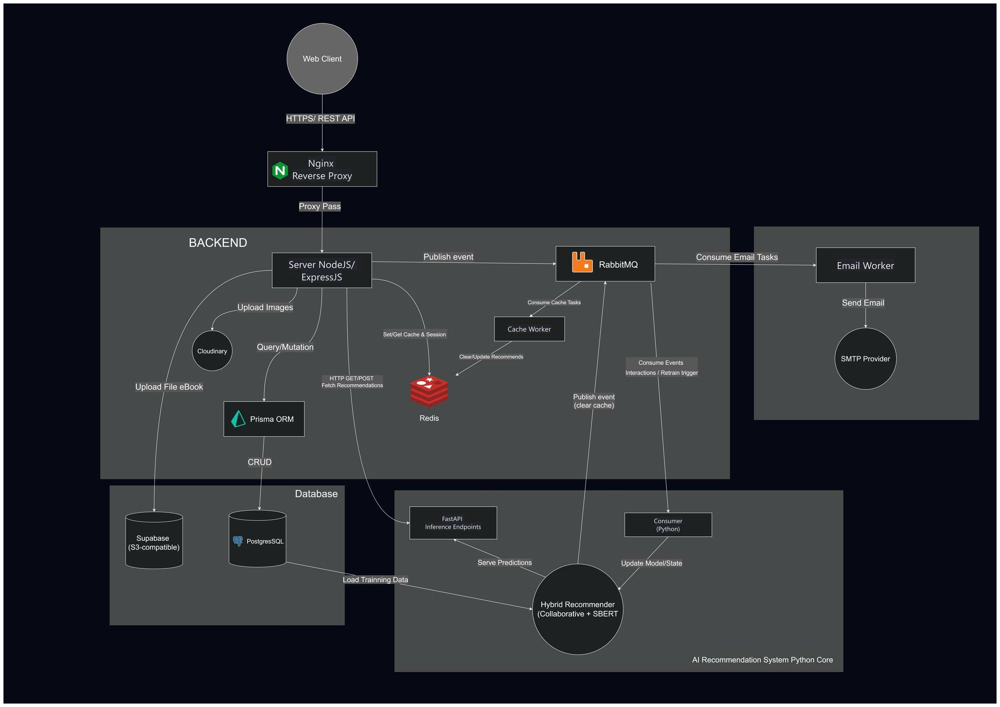
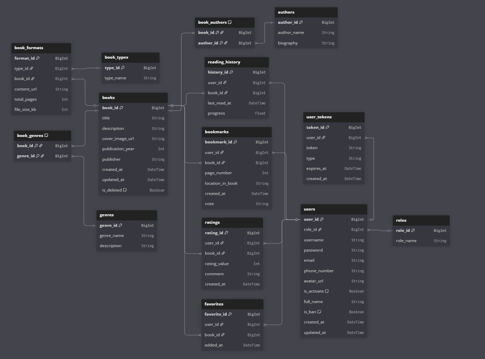

# TekBook Backend API

The backend service for the TekBook book recommendation platform. Built on **Express 5** with **Prisma ORM**, this server exposes a versioned REST API (`/api/v1`) that handles authentication, book catalog management, user interactions, and proxies requests to an external Python-based recommendation engine. Asynchronous workloads (transactional email, cache invalidation) are offloaded to dedicated **RabbitMQ** worker processes.

---

## Table of Contents

- [Architecture Overview](#architecture-overview)
- [System Design Diagram](#system-design-diagram)
- [Technology Stack](#technology-stack)
- [Project Structure](#project-structure)
- [Prerequisites](#prerequisites)
- [Environment Variables](#environment-variables)
- [Getting Started](#getting-started)
  - [Local Development](#local-development)
  - [Docker Deployment](#docker-deployment)
- [Available Scripts](#available-scripts)
- [API Reference](#api-reference)
  - [Authentication](#authentication)
  - [Books (Public)](#books-public)
  - [Bookmarks](#bookmarks)
  - [Favorites](#favorites)
  - [Ratings](#ratings)
  - [Reading History](#reading-history)
  - [User Profile](#user-profile)
  - [Recommendations](#recommendations)
  - [Admin - Books](#admin---books)
  - [Admin - Genres](#admin---genres)
  - [Admin - Authors](#admin---authors)
  - [Admin - Users](#admin---users)
  - [Admin - Dashboard](#admin---dashboard)
  - [Admin - Recommendation System](#admin---recommendation-system)
  - [Admin - Redis Inspector](#admin---redis-inspector)
- [Database Schema](#database-schema)
- [Authentication and Security](#authentication-and-security)
- [Background Workers](#background-workers)
- [Error Handling](#error-handling)
- [Infrastructure](#infrastructure)

---

## Architecture Overview



The API server acts as the sole entry point for all client requests. It delegates long-running or non-critical tasks to RabbitMQ-backed workers, ensuring low-latency responses. The recommendation engine is a separate FastAPI service; this backend proxies admin management endpoints and caches recommendation results in Redis.

---

## System Design Diagram

<!-- Replace the path below with the actual system design image -->


---

## Technology Stack

| Category            | Technology                                      |
| ------------------- | ----------------------------------------------- |
| **Runtime**         | Node.js 22 (Alpine)                             |
| **Framework**       | Express 5                                       |
| **Language**        | JavaScript (ES Modules)                         |
| **ORM**             | Prisma 7 with PostgreSQL adapter (`@prisma/adapter-pg`) |
| **Database**        | PostgreSQL 16                                   |
| **Cache / Sessions**| Redis 7                                         |
| **Message Broker**  | RabbitMQ 3 (with Management plugin)             |
| **Object Storage**  | MinIO (S3-compatible) via AWS SDK v3             |
| **Image CDN**       | Cloudinary                                      |
| **Authentication**  | JWT (access + refresh tokens), Google OAuth      |
| **Email**           | Resend / Nodemailer                             |
| **Validation**      | Joi                                             |
| **Security**        | Helmet, CORS, express-rate-limit, bcrypt        |
| **Containerization**| Docker, Docker Compose                          |
| **Reverse Proxy**   | Nginx (TLS, HTTP-to-HTTPS redirect)             |

---

## Project Structure

```
.
├── server.js                  # Entry point — connects Redis, RabbitMQ, starts Express
├── prisma.config.js           # Prisma configuration (schema path, migrations)
├── package.json
├── Dockerfile                 # Multi-stage production build
├── docker-compose.yml         # Full stack orchestration
├── nginx/
│   └── nginx.conf             # Reverse proxy with TLS
├── workers/
│   ├── email.worker.js        # RabbitMQ consumer — transactional email
│   └── cache-invalidation.worker.js  # RabbitMQ consumer — Redis cache flush
├── app/
│   ├── index.js               # Express app setup (middleware, CORS, routing)
│   ├── config/
│   │   ├── redis.js           # Redis singleton client with reconnect
│   │   ├── rabbitmq.js        # RabbitMQ singleton with exponential backoff
│   │   ├── storageConfig.js   # MinIO / S3 client and presigned URL helpers
│   │   └── cloudinary.config.js
│   ├── constants/             # Role definitions, enums
│   ├── controllers/
│   │   ├── auth/              # Login, register, OAuth, token refresh, password reset
│   │   ├── user/              # Book browsing, bookmarks, favorites, ratings, history
│   │   └── admin/             # CRUD for books/genres/authors, user management, dashboard
│   ├── services/              # Business logic layer
│   ├── routes/
│   │   ├── auth/              # Public and protected auth routes
│   │   ├── user/              # Public and authenticated user routes
│   │   └── admin/             # Admin-only routes (JWT + role guard)
│   ├── middlewares/
│   │   ├── authenticateToken.js       # JWT Bearer verification
│   │   ├── authorize.middleware.js    # Role-based access control
│   │   ├── validation.middleware.js   # Joi schema validation
│   │   ├── rateLimit.middleware.js    # Per-route rate limiting
│   │   ├── upload.middleware.js       # Multer file upload (memory storage)
│   │   └── errorHandler.js           # Global error handler + 404
│   ├── validators/            # Joi schemas for request validation
│   ├── publishers/            # RabbitMQ publish helpers
│   ├── mappers/               # Data transformation utilities
│   ├── lib/                   # Prisma client instance
│   ├── utils/                 # JWT, hashing, logging, API response helpers
│   └── prisma/
│       ├── schema.prisma      # Database schema definition
│       └── migrations/        # Prisma migration history
└── docs/                      # Additional documentation
```

---

## Prerequisites

- **Node.js** >= 22.x
- **PostgreSQL** >= 16
- **Redis** >= 7
- **RabbitMQ** >= 3.x
- **Docker** and **Docker Compose** (for containerized deployment)

---

## Environment Variables

Create a `.env` file in the project root. The following variables are required:

| Variable                    | Description                                      |
| --------------------------- | ------------------------------------------------ |
| `PORT`                      | Server port (default: `8080`)                    |
| `BASE_URL`                  | API base path (default: `/api/v1`)               |
| `NODE_ENV`                  | `development` or `production`                    |
| `FRONTEND_URL`              | Allowed CORS origin for the frontend client      |
| **Database**                |                                                  |
| `DATABASE_URL`              | PostgreSQL connection string (Prisma)             |
| `DIRECT_URL`                | Direct PostgreSQL URL (bypasses connection pool)  |
| **Redis**                   |                                                  |
| `REDIS_HOST`                | Redis server hostname                            |
| `REDIS_PORT`                | Redis server port                                |
| `REDIS_PASSWORD`            | Redis authentication password                    |
| `REDIS_USERNAME`            | Redis username (default: `default`)              |
| **RabbitMQ**                |                                                  |
| `RABBITMQ_URL`              | AMQP connection string                           |
| `RABBITMQ_USER`             | RabbitMQ management user                         |
| `RABBITMQ_PASSWORD`         | RabbitMQ management password                     |
| **JWT**                     |                                                  |
| `JWT_ACCESS_SECRECT`        | Secret key for signing access tokens             |
| `JWT_REFRESH_SECRECT`       | Secret key for signing refresh tokens            |
| **MinIO / S3**              |                                                  |
| `MINIO_ENDPOINT`            | S3-compatible endpoint URL                       |
| `MINIO_ACCESS_KEY`          | Access key ID                                    |
| `MINIO_SECRET_KEY`          | Secret access key                                |
| `MINIO_BUCKET`              | Bucket name for book files                       |
| `MINIO_REGION`              | Region (default: `us-east-1`)                    |
| **Cloudinary**              |                                                  |
| `CLOUDINARY_CLOUD_NAME`     | Cloudinary cloud name                            |
| `CLOUDINARY_API_KEY`        | Cloudinary API key                               |
| `CLOUDINARY_API_SECRET`     | Cloudinary API secret                            |
| **Recommendation Service**  |                                                  |
| `RECOMMENDATION_SERVICE_URL`| URL of the FastAPI recommendation engine         |

---

## Getting Started

### Local Development

```bash
# 1. Install dependencies
npm install

# 2. Generate Prisma client
npx prisma generate

# 3. Run database migrations
npx prisma migrate deploy

# 4. Start the development server (with hot reload via nodemon)
npm run dev

# 5. In separate terminals, start the background workers
npm run worker:email
npm run worker:cache
```

The server will start on `http://localhost:8080`. The API is accessible at `http://localhost:8080/api/v1`.

### Docker Deployment

The `docker-compose.yml` orchestrates the full stack: API server, email worker, cache worker, Redis, RabbitMQ, Nginx reverse proxy, and a one-shot migration runner.

```bash
# Build and start all services
docker compose up -d --build

# View logs
docker compose logs -f backend

# Run migrations (executed automatically by the migrate service)
docker compose run --rm migrate
```

The Dockerfile uses a multi-stage build to produce a minimal production image:

1. **deps** -- installs production dependencies only (`npm ci --omit=dev`)
2. **builder** -- generates the Prisma client
3. **runner** -- copies only the required artifacts, runs as a non-root user (`appuser:1001`)

---

## Available Scripts

| Script              | Command                                | Description                             |
| ------------------- | -------------------------------------- | --------------------------------------- |
| `npm run dev`       | `nodemon server.js`                    | Start with hot reload (development)     |
| `npm run build`     | `prisma generate`                      | Generate the Prisma client              |
| `npm start`         | `node server.js`                       | Start the production server             |
| `npm run worker:email` | `node workers/email.worker.js`      | Start the email worker process          |
| `npm run worker:cache` | `node workers/cache-invalidation.worker.js` | Start the cache invalidation worker |
| `npm run lint`      | `eslint .`                             | Run ESLint                              |
| `npm run lint:fix`  | `eslint . --fix`                       | Run ESLint with auto-fix                |

---

## API Reference

All endpoints are prefixed with `/api/v1`. Authenticated endpoints require a `Bearer` token in the `Authorization` header. Admin endpoints additionally require the `ADMIN` role.

### Authentication

| Method | Endpoint                  | Auth     | Rate Limit       | Description                              |
| ------ | ------------------------- | -------- | ---------------- | ---------------------------------------- |
| POST   | `/auth/register`          | No       | 10 req / 1 hour  | Register with email and password         |
| POST   | `/auth/login`             | No       | 5 req / 15 min   | Login with email/username and password   |
| POST   | `/auth/google`            | No       | --               | Google OAuth login                       |
| POST   | `/auth/activate`          | No       | --               | Activate account via email token         |
| POST   | `/auth/refresh`           | Cookie   | --               | Refresh access token (HttpOnly cookie)   |
| POST   | `/auth/logout`            | No       | --               | Logout current device (clears cookie)    |
| POST   | `/auth/forgot-password`   | No       | 3 req / 15 min   | Request password reset email             |
| POST   | `/auth/reset-password`    | No       | --               | Reset password with token                |
| POST   | `/auth/logout-all`        | Bearer   | --               | Logout all devices                       |
| GET    | `/auth/sessions`          | Bearer   | --               | List all active sessions                 |
| GET    | `/auth/profile`           | Bearer   | --               | Get authenticated user profile           |

### Books (Public)

| Method | Endpoint                              | Auth   | Description                          |
| ------ | ------------------------------------- | ------ | ------------------------------------ |
| GET    | `/books`                              | No     | List all books (paginated)           |
| GET    | `/books/most-read`                    | No     | Get most-read books                  |
| GET    | `/books/search`                       | No     | Search books by keyword              |
| GET    | `/books/genre/:genreId`               | No     | Get books by genre                   |
| GET    | `/books/:bookId`                      | No     | Get book details by ID               |
| GET    | `/books/:bookId/preview`              | No     | Get book preview                     |
| GET    | `/books/:bookId/read-url`             | No     | Get presigned URL for reading        |
| GET    | `/books/:bookId/download/:formatId`   | No     | Download book in specified format    |
| GET    | `/books/:bookId/same-genre`           | No     | Get books in the same genre          |
| GET    | `/books/:bookId/ratings`              | No     | Get paginated ratings for a book     |
| GET    | `/books/:bookId/formats`              | No     | Get available formats for a book     |

### Bookmarks

| Method | Endpoint                        | Auth   | Description                |
| ------ | ------------------------------- | ------ | -------------------------- |
| GET    | `/books/:bookId/bookmarks`      | Bearer | List bookmarks for a book  |
| POST   | `/books/:bookId/bookmarks`      | Bearer | Create a bookmark          |
| PUT    | `/bookmarks/:bookmarkId`        | Bearer | Update a bookmark          |
| DELETE | `/bookmarks/:bookmarkId`        | Bearer | Delete a bookmark          |

### Favorites

| Method | Endpoint                        | Auth   | Description                |
| ------ | ------------------------------- | ------ | -------------------------- |
| GET    | `/users/favorites`              | Bearer | List user favorites        |
| POST   | `/users/favorites/:bookId`      | Bearer | Add book to favorites      |
| DELETE | `/users/favorites/:bookId`      | Bearer | Remove book from favorites |

### Ratings

| Method | Endpoint                            | Auth   | Description                     |
| ------ | ----------------------------------- | ------ | ------------------------------- |
| GET    | `/books/:bookId/ratings`            | No     | Get all ratings for a book      |
| GET    | `/books/:bookId/average-rating`     | No     | Get average rating              |
| GET    | `/books/:bookId/ratings/me`         | Bearer | Get current user's rating       |
| POST   | `/books/:bookId/ratings`            | Bearer | Create or update a rating       |
| DELETE | `/books/:bookId/ratings`            | Bearer | Delete user's rating            |

### Reading History

| Method | Endpoint                            | Auth   | Description                     |
| ------ | ----------------------------------- | ------ | ------------------------------- |
| GET    | `/users/history`                    | Bearer | Get reading history (paginated) |
| GET    | `/users/books/:bookId/progress`     | Bearer | Get reading progress for a book |
| POST   | `/users/books/:bookId/history`      | Bearer | Record reading progress         |

### User Profile

| Method | Endpoint                    | Auth   | Description              |
| ------ | --------------------------- | ------ | ------------------------ |
| GET    | `/users/profile`            | Bearer | Get user profile         |
| PUT    | `/users/profile`            | Bearer | Update profile details   |
| PATCH  | `/users/avatar`             | Bearer | Upload new avatar image  |
| PATCH  | `/users/change-password`    | Bearer | Change password          |

### Recommendations

| Method | Endpoint              | Auth   | Description                              |
| ------ | --------------------- | ------ | ---------------------------------------- |
| GET    | `/recommendations`    | Bearer | Get personalized book recommendations    |
| GET    | `/similar-books`      | No     | Get similar books (content-based)        |

### Admin - Books

All admin endpoints require `Bearer` token with `ADMIN` role.

| Method | Endpoint                              | Description                        |
| ------ | ------------------------------------- | ---------------------------------- |
| GET    | `/admin/books`                        | List all books (admin view)        |
| GET    | `/admin/books/deleted`                | List soft-deleted books            |
| POST   | `/admin/books/create`                 | Create a book (multipart upload)   |
| PUT    | `/admin/books/update/:bookId`         | Update book details and files      |
| DELETE | `/admin/books/delete/:bookId`         | Soft-delete a book                 |
| DELETE | `/admin/books`                        | Bulk soft-delete books             |
| PATCH  | `/admin/books/restore/:bookId`        | Restore a soft-deleted book        |
| DELETE | `/admin/books/hard-delete/:bookId`    | Permanently delete a book          |

### Admin - Genres

| Method | Endpoint                            | Auth  | Description              |
| ------ | ----------------------------------- | ----- | ------------------------ |
| GET    | `/admin/books/genres`               | No    | List genres (paginated)  |
| POST   | `/admin/genres/create`              | Admin | Create a genre           |
| PUT    | `/admin/genres/update/:genreId`     | Admin | Update a genre           |
| DELETE | `/admin/genres/delete/:genreId`     | Admin | Delete a genre           |

### Admin - Authors

| Method | Endpoint                        | Auth  | Description              |
| ------ | ------------------------------- | ----- | ------------------------ |
| GET    | `/authors`                      | No    | List all authors         |
| GET    | `/authors/:authorId`            | No    | Get author by ID         |
| POST   | `/admin/authors`                | Admin | Create an author         |
| PUT    | `/admin/authors/:authorId`      | Admin | Update an author         |
| DELETE | `/admin/authors/:authorId`      | Admin | Delete an author         |

### Admin - Users

| Method | Endpoint                    | Auth  | Description              |
| ------ | --------------------------- | ----- | ------------------------ |
| GET    | `/admin/users`              | Admin | List all users           |
| PATCH  | `/users/:userId/ban`        | Admin | Ban a user               |
| PATCH  | `/users/:userId/unban`      | Admin | Unban a user             |
| PATCH  | `/users/ban`                | Admin | Bulk ban users           |

### Admin - Dashboard

| Method | Endpoint                                | Auth  | Description                |
| ------ | --------------------------------------- | ----- | -------------------------- |
| GET    | `/admin/dashboard/stats`                | Admin | Platform-wide statistics   |
| GET    | `/admin/dashboard/top-rated-books`      | Admin | Top-rated books            |
| GET    | `/admin/dashboard/top-favorited-books`  | Admin | Most-favorited books       |
| GET    | `/admin/dashboard/new-users`            | Admin | Recently registered users  |

### Admin - Recommendation System

These endpoints proxy to the external FastAPI recommendation engine.

| Method | Endpoint                                          | Description                          |
| ------ | ------------------------------------------------- | ------------------------------------ |
| GET    | `/admin/recommendation/health`                    | Health check of the RS               |
| GET    | `/admin/recommendation/model-info`                | Model metadata and version           |
| POST   | `/admin/recommendation/retrain`                   | Trigger full model retrain           |
| GET    | `/admin/recommendation/online-learning/status`    | Online learning status               |
| POST   | `/admin/recommendation/online-learning/enable`    | Enable online learning               |
| POST   | `/admin/recommendation/online-learning/disable`   | Disable online learning              |
| POST   | `/admin/recommendation/online-learning/update`    | Trigger incremental model update     |
| GET    | `/admin/recommendation/cache/stats`               | Cache statistics by key type         |
| DELETE | `/admin/recommendation/cache`                     | Clear all recommendation caches      |

### Admin - Redis Inspector

| Method | Endpoint                  | Auth  | Description                          |
| ------ | ------------------------- | ----- | ------------------------------------ |
| GET    | `/admin/redis/caches`     | Admin | List all recommendation cache keys   |
| GET    | `/admin/redis/value`      | Admin | Get value for a specific Redis key   |

---

## Database Schema

The PostgreSQL schema is managed by Prisma and defines the following models:

| Model             | Description                                          |
| ----------------- | ---------------------------------------------------- |
| `users`           | User accounts with role reference and ban/activation flags |
| `roles`           | Role definitions (`USER`, `ADMIN`)                   |
| `user_tokens`     | Stored tokens (activation, password reset)            |
| `books`           | Book catalog with soft-delete support                |
| `authors`         | Author information                                   |
| `book_authors`    | Many-to-many relation between books and authors      |
| `genres`          | Genre definitions                                    |
| `book_genres`     | Many-to-many relation between books and genres       |
| `book_types`      | Format types (e.g., PDF, EPUB)                       |
| `book_formats`    | Specific format entries with file URLs and metadata  |
| `bookmarks`       | User bookmarks within a book (page, note)            |
| `favorites`       | User favorite books                                  |
| `ratings`         | User ratings and comments for books                  |
| `reading_history` | Reading progress tracking per user per book          |

### Entity-Relationship Diagram

<!-- Replace the path below with the actual ERD image -->


---

## Authentication and Security

**Token Strategy:**

- **Access Token** -- Short-lived JWT (configurable, issued by `tekbook-api`, audience `tekbook-client`). Contains user claims. Sent via `Authorization: Bearer <token>` header.
- **Refresh Token** -- Long-lived JWT (7 days). Sent as an `HttpOnly`, `Secure`, `SameSite=None` cookie. Contains only the token type; user data is retrieved from the Redis session store.

**Session Management:**

Sessions are stored in Redis using the key pattern `session:{userId}:{jti}`. Each login creates a new session, enabling multi-device support. Refresh tokens are hashed (SHA-256) before storage. Token rotation is enforced on every refresh: the old session is revoked, and a new one is created. Token reuse detection triggers a full session revocation across all devices.

**Security Middleware:**

- **Helmet** -- Sets security-related HTTP headers (referrer policy, content security policy).
- **CORS** -- Restricted to allowed origins with credentials support.
- **Rate Limiting** -- Per-route limits: login (5 / 15 min), registration (10 / hour), forgot-password (3 / 15 min).
- **Bcrypt** -- Password hashing with salt rounds.
- **Input Validation** -- Joi schemas validate all request bodies, params, and query strings.

---

## Background Workers

Workers run as independent Node.js processes, each consuming from a dedicated RabbitMQ queue. They share the same codebase and Docker image but are started with different entry commands.

### Email Worker

- **Queue:** `email_queue`
- **Script:** `npm run worker:email`
- **Job Types:** `ACCOUNT_ACTIVATION`, `PASSWORD_RESET`
- **Behavior:** Parses the message payload, delegates to the appropriate email service function (Resend / Nodemailer), and acknowledges the message. Malformed or unrecognized messages are nacked without requeue.

### Cache Invalidation Worker

- **Queue:** `cache_invalidation_queue`
- **Script:** `npm run worker:cache`
- **Job Types:** `RETRAIN_COMPLETE` (flushes all `rec:*` keys), `INCREMENTAL_UPDATE` (invalidates specific user caches)
- **Behavior:** Connects to both Redis and RabbitMQ. Uses `SCAN` (never `KEYS`) for production-safe key lookup.

### RabbitMQ Queue Registry

| Queue Name                  | Publisher                 | Consumer                     |
| --------------------------- | ------------------------- | ---------------------------- |
| `email_queue`               | Auth controllers          | Email Worker                 |
| `cache_invalidation_queue`  | Recommendation Service    | Cache Invalidation Worker    |
| `rs_feedback_queue`         | Rating/Favorite/History   | Recommendation Service       |
| `rs_retrain_queue`          | Admin controller          | Recommendation Service       |

All queues are declared as **durable** with **persistent** message delivery. The channel prefetch is set to `1`, ensuring messages are processed sequentially per worker. Reconnection uses exponential backoff (500ms base, 30s cap, 10 max retries).

---

## Error Handling

All API responses follow a standardized JSON structure:

```json
{
  "success": true,
  "message": "Success",
  "data": { }
}
```

Error responses:

```json
{
  "success": false,
  "message": "Description of the error",
  "code": "ERROR_CODE",
  "errors": []
}
```

The global error handler intercepts and normalizes errors from the following sources:

| Source          | Handling                                                      |
| --------------- | ------------------------------------------------------------ |
| **AppError**    | Custom application errors with status code and error code    |
| **JWT Errors**  | `TokenExpiredError`, `JsonWebTokenError` mapped to `401`     |
| **Prisma**      | `P2002` (conflict), `P2025` (not found), `P2003`/`P2014` (bad request) |
| **Multer**      | File upload errors mapped to `400`                           |
| **Unknown**     | `500` with sanitized message in production                   |

---

## Infrastructure

### Docker Compose Services

| Service          | Image / Build | Port(s)       | Description                              |
| ---------------- | ------------- | ------------- | ---------------------------------------- |
| `backend`        | Build (`.`)   | `8080:8080`   | Main API server                          |
| `worker-email`   | Build (`.`)   | --            | Email worker process                     |
| `worker-cache`   | Build (`.`)   | --            | Cache invalidation worker process        |
| `migrate`        | Build (`.`)   | --            | One-shot Prisma migration runner         |
| `redis`          | `redis:7-alpine` | --         | Redis with password authentication       |
| `rabbitmq`       | `rabbitmq:3-management-alpine` | `5672` (localhost only) | Message broker |
| `nginx`          | `nginx:alpine` | `80`, `443` | TLS termination and reverse proxy        |

### Nginx Configuration

- Listens on `api.tekbook.website`
- HTTP (port 80) redirects to HTTPS (port 443)
- TLS with certificates mounted from `./nginx/certs/`
- Proxies all traffic to the `backend` upstream on port 8080
- Sets `X-Real-IP`, `X-Forwarded-For`, and `X-Forwarded-Proto` headers
- `client_max_body_size` set to `30M` for file uploads

### Graceful Shutdown

The server and all workers handle `SIGTERM` and `SIGINT` signals. On shutdown, open connections to RabbitMQ and Redis are closed before the process exits, preventing message loss and connection leaks.

---

## License

ISC
